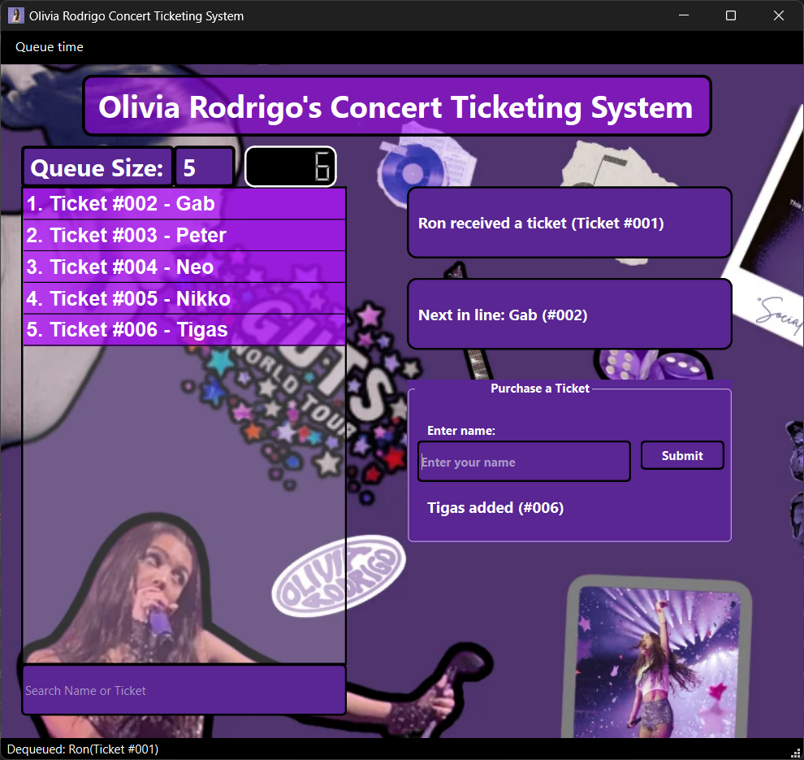

# Olivia Rodrigo Concert Ticketing System

For our Queue data structure assignment.

## Features

- Enqueue and dequeue concert attendees.
- Display the current queue with formatted ticket numbers.
- Search attendees by name or ticket number.
- Automatic dequeue at specified intervals.
- Play background music.

## Requirements

- Windows OS
- Qt 6.7.2 or later

## Installation

1. **Download the ZIP File**: [Download the application](https://github.com/lucifron28/Ticket-Management-System-Using-Queue-Data-Structure/blob/main/Cada-Queue.zip).

2. **Extract the ZIP File**: Extract the contents of the ZIP file to a directory of your choice.

3. **Run the Application**: Navigate to the extracted directory and double-click on `ConcertTicketingSystem.exe` to run the application.

## Usage

1. **Add Attendee**: Enter the attendee's name in the "Enter your name" field and press Enter or click the "Enqueue" button.

2. **Search Attendee**: Use the search bar to find attendees by name or ticket number. To search by ticket number, prefix the search term with `#`.

3. **Automatic Dequeue**: The application will automatically dequeue attendees at the specified interval. You can change the interval from the menu.

4. **Background Music**: The application plays background music automatically. You can control the volume from the system's audio settings.

## Screenshots

*Main window showing the queue and controls.*
